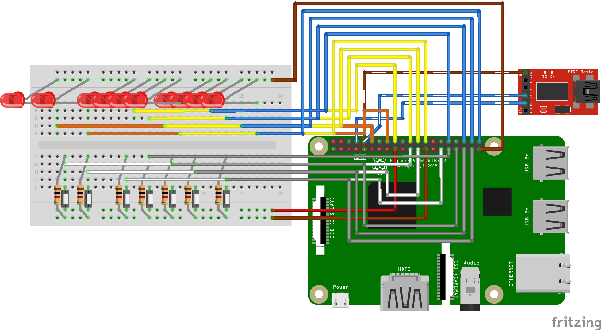
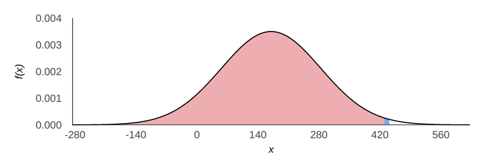

---
title : "Binary Calculator on bare-metal Raspberry Pi 4"
date: "February 2020"
author: "Andrea Augello, Università degli Studi di Palermo"

---
# Introduction

# Hardware





## Raspberry Pi model 4B


The target for this project is a general-purpose Single-Board Computer: the Raspberry Pi 4B [Fig. \ref{pi4}], it is the latest iteration of the Raspberry Pi SoC, launched on 24th June 2019[@PI_release],
it replaces the older Raspberry Pi 3 B+ which was based on the Broadcom BCM2835 chip[@BCM2835][@BCM2835_datasheet_errata] and boasts high-end specs:

* A 1.5GHz quad-core 64-bit ARM Cortex-A72 CPU
* 1GB, 2GB, or 4GB of LPDDR4 SDRAM
* Full-throughput Gigabit Ethernet
* Dual-band 802.11ac wireless networking
* Bluetooth 5.0
* Two USB 3.0 and two USB 2.0 ports
* Dual monitor support, at resolutions up to 4K
* VideoCore VI graphics, supporting OpenGL ES 3.x
* 4Kp60 hardware decode of HEVC video
* Complete compatibility with earlier Raspberry Pi products

Although claiming complete backward compatibility with earlier products, the documentation available[@pi4_datasheet] is not very comprehensive, which makes porting code not always straightforward.

## FTDI FT232RL
The FT232RL is a USB to serial UART interface[@FT232RL].
Without this peripheral, it is not possible to send data to and from the  Board with ease: modern computers do not expose serial ports that can be connected to the GPIOs.  
This module is needed to provide a virtual communication port for the computer to send data over to the Pi.
The FTDI module is connected to a computer through its USB port, and to the Raspberry Pi 4 UART1 by the following configuration:


* FTDI-RX to RPi-GPIO14 (TX)
* FTDI-TX to RPi-GPIO15 (RX)
* FTDI-Ground to RPi-GND

## I/O choices
### Qteatak push buttons


With ease of use and familiarity of a potential end-user with similar products in mind, push buttons were considered an appropriate choice for the input method,
moreover, single buttons were chosen in favor of a button matrix because a 3x3 button matrix would require 6 pin connections against the 7 needed in the other case, but the added complexity does not make it a worthwhile trade-off.  

The chosen buttons are 6x6x5 mm tactile push buttons with two pins produced by Qteatak, a Shenzhen based electronics company.  
These buttons are rated to work with up to 12V of direct current, so they are safe for use with the 3,3V output of the GPIO pins of the Raspberry.

Their mechanical life expectancy is of 100000 uses which leads to a worst-case scenario of 6250 operations before a malfunction, considering the intended purpose of this project, such a life expectancy is deemed sufficient.  

### LED


Due to the choice of base two for the calculator, a straightforward approach to display values is through the use of LED lights, with lit LEDs representing a 1 bit and an off light representing a 0 bit.    


To avoid possible confusion when interpreting the result, an extra LED lights up to signal if the shown number is negative and, as such, has to be read as a two's complement.  
Moreover, since there is a very limited number of bits to display values if the actual result of an operation lies outside the representable range and is thus truncated, an extra LED light will turn on to signal the overflow.

### GPIO assignment

As shown in the following table

GPIO# | Function
------|---------
 5|Input
 6|Input
 7|Output
 8|Output
 9|Input
11|Input
12|Output
13|Input
14|TX
15|RX
16|Output
18|Output
19|Input
20|Output
21|Output
23|Output
24|Output
25|Output
26|Input

# Environment


## pijFORTHos

FORTH interpreters can be implemented easily for resource-constrained machines using no OS, so they are well-suited for bare-metal interactive development.

 The pijFORTHos environment is based on an assembly FORTH interpreter called JonesForth, originally written for i686 assembly by _Richard WM Jones_.

 Due to its semplicity JonesForth has been adapted to many different architectures, some of those portings  brought to the Bare-Metal OS for the Raspberry Pi.  
 This


## Ubuntu 19.04

## Picocom and Minicom
Minicom is a terminal emulator software for Unix-like operating systems. It is commonly used when setting up a remote serial console.[@Minicom]  
Picocom is, in principle, very similar to minicom.
It was designed as a simple, manual, modem configuration, testing, and debugging tool.[@Picocom]  


In effect, picocom is not an "emulator" per se. It is a simple program that opens, configures, manages a serial port (tty device) and its settings, and connects to it the terminal emulator already in use.

In the scope of this project, it is used as a serial communications program to allow access to the serial console of the Raspberry.

As ASCII-XFR[@ASCII] was chosen to send the source file to the Raspberry, it  

[...]

Trough the command
`picocom --b 115200 /dev/tyyUSB0 --imap delbs -s "ascii-xfr -sv -l100 -c10"
` picocom is launched on the development machine with the same VCP parameters as the Pi UART:

* `--b 115200`: 115200 bit/s bit rate.
* `--imap delbs`: allows the use of backspace to delete a character.
* `-s "ascii-xfr -sv -l100 -c10"`: specifies ascii-xfr as the external command to use for transmitting files.
    * `-sv`: verbose send mode.
    * `-l100`: sets a 100 milliseconds delay after each line is sent, this usually gives enough time to run a command and be ready for the next line in time.
    * `-c10`: waits 8 milliseconds between each character sent.

# Software
Since it is not possible with the selected environment to have the Raspberry automatically load the source code at startup, the code is to be sent via a serial connection.

The file transfer happens character by character at a quite limited speed, with significant delay after every character and newline, furthermore, every file has to be selected singularly.  
To cut down on transfer times, it is convenient to use a bash script to exclude unessential parts of the code (i.e. comments and empty lines), remove unnecessary newlines, and merge everything into a single file.

The developed script, `merge_source.sh`, makes use of `awk`[@awk] to recognize comments and not print them, and remove newlines,
 `sed`[@sed] adds a newline after each ';' so that after each word is compiled, there will be a 100 ms delay.  
A back-of-the-envelope estimate shows a reduction of the loading time of 76.9 seconds.

```bash
#!/bin/bash

cd src
cat se-ans.f utils.f logic.f output.f input.f control.f |
awk -F"\\" '{print $1}' |                          # Removes '\' comments
awk -F"[^A-Z]+[()][^A-Z]+" '{print $1 $    3}' |   # Removes '( )' comments
awk '{ printf "%s ", $0 }' |                       # Removes newlines
sed 's/\;/\;\n/g' |                                # Adds a newline after ;
sed '/^[[:space:]]*$/d' > ../merged_src.f   

```

## ANSI compliance
JonesForth is not ANSI compliant[@pijFORTHos], hence some standard words do not behave as one would expect.

The `se-ans.f` code provided in the course materials contains some definitions to ensure compliance for some words of common use.

This code is the first to be loaded to ensure that the subsequent instructions are executed correctly.

## Utilities

This section of code provides some hardware abstraction
The Raspberry Pi 4 B has a different procedure to set the internal pull-up/down compared to the older models, hence two functions are provided for compatibility's sake.
The available documentation[@pi4_datasheet] does not show this change yet, however,
by analyzing how some C libraries added support for the Broadcom 2711 GPIO[@pingpio] [@raspi-gpio], one can gain insight on how to change the pull-up/down settings.

## Control flow

## Input


### Debouncing

While testing the input code, a single button press sometimes would, due to a phenomenon known as bouncing[@ganssle2004guide], generate two falling edges.

Although there are some widely available valid hardware solutions[@gay2017mc14490], the nature of this application does not warrant the added hardware complexity: the responsiveness requirements are quite lax, so it is possible to use some CPU cycles to solve the bouncing issues in software.



After extensive testing[^Bounce_test], it was found that the second falling edge happened, on average, after $170.3 \mu s$ $(\sigma = 113.97)$ from the first one,
 so, assuming Gaussian distribution, 99% of the bouncing events will be within $435\mu s$ ,[Fig. \ref{Bouncing_distribution}]  so adding a delay of 1ms before clearing the event detect register is guaranteed to avoid reading a bounce as an actual key press.

[^Bounce_test]: The time intercurring between falling edges was computed by polling the event detection register in a loop and storing a timestamp.
  To achieve more accurate readings, all output operations were executed after the measurements were completed.

According to [@kinkead1975typing] and [@wiklund1987optimizing], the expected typing speed of a user is such that the aforementioned delay would not introduce a noticeable delay.


## Output

## Inner representation


# Conclusion


## Possible improvements

# References

[Bibtex file](./paper.bib)
