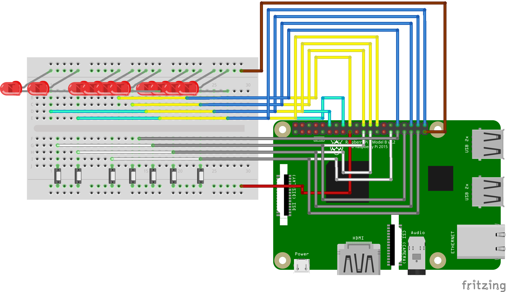

# Binary Calculator

## Introduction

## Hardware


### Raspberry Pi model 4B


### FTDI FT232RL
The FT232RL is a USB to serial UART interface<sup>[[9]](##References)</sup>,
it has been connected to the Raspberry Pi 4 UART1 in the following configuration:
* FTDI-RX to RPi-GPIO14 (TX)
* FTDI-TX to RPi-GPIO16 (RX)
* FTDI-Ground to RPi-GND

The micro USB of the FTDI module was connected to a USB port on a computer with the appropriate software to use it.
Without this module, it would not have been possible to send data to and from the  Board.

### I/O choices
#### QTEATAK push buttons
6x6x5 mm tactile push buttons with two pins, they are rated to work with up to 12V of direct current, so they are safe for use with the 3,3V output of the GPIO pins of the Raspberry.

Their mechanical life expectancy is of 100000 uses which leads to a worst-case scenario of 6250 operations before a malfunction, that is deemed sufficient for the intended purpose of this project.  
#### LED



## Environment


### pijFORTHos
 The pijFORTHos environment is based on an assembly FORTH interpreter called JonesForth, originally written for i686 assembly by _Richard WM Jones_.

 Following portings  brought to the Bare-Metal OS for the Raspberry Pi

### Ubuntu 19.04

### Picocom and Minicom
Minicom is a terminal emulator software for Unix-like operating systems, it is commonly used when setting up a remote serial console.<sup>[[7]](##References)</sup>

Picocom is, in principle, very similar to minicom.
It was designed as a simple, manual, modem configuration, testing, and debugging tool.<sup>[[10]](##References)</sup>

In effect, picocom is not an "emulator" per se. It is a simple program that opens, configures, manages a serial port (tty device) and its settings, and connects to it the terminal emulator already in use.

In the scope of this project, it is used as a serial communications program to allow access to the serial console of the Raspberry.

As ASCII-XFR<sup>[[8]](##References)</sup> was chosen to send the source file to the Raspberry, it  

[...]

Trough the command
`sudo picocom --b 115200 /dev/ttyUSB0 --imap delbs -s "ascii-xfr -sv -l100 -c10"
`

## Software
Since it is not possible with the selected environment to have the Raspberry automatically load the source code at startup, the code is to be sent via a serial connection.

Since the file transfer happens character by character at a quite limited speed and every file has to be selected singularly, it is convenient to use a bash script to remove unessential parts of the code (i.e. comments and empty lines) and merge everything into a single file.

The developed script, `merge_source.sh`, makes use of `awk` to recognize comments and not print them, and `sed` to remove lines containing only whitespaces.

```
#!/bin/bash
cd src
cat se-ans.f setup.f logic.f output.f input.f control.f |
awk -F"\\" '{print $1}' |
awk -F"[^A-Z]+[()][^A-Z]+" '{print $1 $    3}' |
sed '/^[[:space:]]*$/d' > ../merged_src.f

```


### ANSI compliance
JonesForth is not ANSI compliant<sup>[[6]](##References)</sup>, hence some standard words do not behave as one would expect.

The `se-ans.f` code provided in the course materials contains some definitions to ensure compliance for some words of common use.

This code is the first to be loaded to ensure that the subsequent instructions are executed correctly.

### Utilities

The Raspberry Pi 4 B has a different procedure to set the internal pull-up/down compared to the older models, hence two functions are provided for compatibility's sake.
This has not yet been documented, however one can gain insight on how to change the pull-up/down settings by analyzing how some c libraries added support for the Broadcom 2711 GPIO<sup>[[12]](##References)[[13]](##References)</sup>

### Control flow

### Input


#### Debouncing

While testing the input code it occurred that a single button press sometimes originated up to three valid reads from the `GPEDS0` register, a phenomenon known as bouncing.<sup>[[1]](##References)</sup>

Although there are some widely available valid hardware solutions<sup>[[11]](##References)</sup> the nature of this application does not warrant the added hardware complexity:
By trial and error it was found that the bouncing lasts less than 0.2 seconds, and
it is not unreasonable to assume that two keypresses in less than 0.2 seconds are unlikely to occur, therefore it is feasible to implement a software workaround by adding a delay after each successful read,
and then clearing the register before polling again.


### Output

### Inner representation


## Conclusion


### Possible improvements


## References
[1] [Jack G. Ganssle - A guide to debouncing ](https://my.eng.utah.edu/~cs5780/debouncing.pdf)

[2]  [Sean Eron Anderson - Bit Twiddling Hacks](https://graphics.stanford.edu/~seander/bithacks.html)

[3] [Raspberry Pi 4 Model B preliminary datasheet](https://github.com/raspberrypi/documentation/blob/master/hardware/raspberrypi/bcm2711/rpi_DATA_2711_1p0_preliminary.pdf)

[4] [BCM2835 ARM Peripherals](https://github.com/raspberrypi/documentation/blob/master/hardware/raspberrypi/bcm2835/BCM2835-ARM-Peripherals.pdf)

[5] [BCM2835 datasheet errata](https://elinux.org/BCM2835_datasheet_errata)

[6] [pijFORTHos built-in words](https://github.com/Avoncliff/pijFORTHos/blob/master/doc/forth.md)

[7] [Minicom man page](http://man8.org/linux/man-pages/man1/minicom.1.html)

[8] [ASCII-XFR man page](http://man7.org/linux/man-pages//man1/ascii-xfr.1.html)

[9] [FT232RL datasheet](https://www.ftdichip.com/Support/Documents/DataSheets/ICs/DS_FT232R.pdf)

[10] [Picocom man page](https://www.mankier.com/1/picocom)

[11] [Gay W. (2017) MC14490 and Software Debouncing. In: Custom Raspberry Pi Interfaces. Apress, Berkeley, CA](https://link.springer.com/chapter/10.1007/978-1-4842-2406-9_5)

[12] [pigpio.c](https://github.com/joan2937/pigpio/blob/master/pigpio.c#L8785)

[13] [raspi-gpio.c](https://github.com/RPi-Distro/raspi-gpio/commit/80fa7d04eafb3ea34fc6f2d32de5f1873b5fb369)
