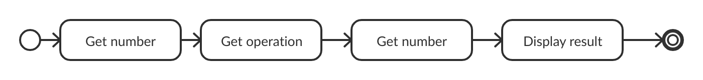
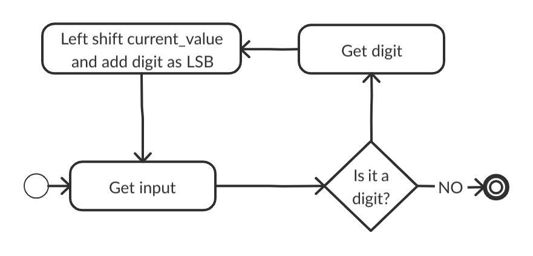

---
title : "Binary Calculator on bare-metal Raspberry Pi 4"
date: "February 2020"
author: "Andrea Augello, Università degli Studi di Palermo"

---
\pagebreak

# Introduction

\pagebreak

# Hardware


## Raspberry Pi model 4B


The target for this project is a general-purpose Single-Board Computer: the Raspberry Pi 4 B [Fig. \ref{pi4}].  
It is the latest iteration of the Raspberry Pi SoC, launched on 24th June 2019[@PI_release],
it replaces the older __Raspberry Pi 3 B+__ which was based on the Broadcom BCM2835 chip[@BCM2835][@BCM2835_datasheet_errata] and boasts high-end specs:

* A 1.5GHz quad-core 64-bit ARM Cortex-A72 CPU
* 1GB, 2GB, or 4GB of LPDDR4 SDRAM
* Full-throughput Gigabit Ethernet
* Dual-band 802.11ac wireless networking
* Bluetooth 5.0
* Two USB 3.0 and two USB 2.0 ports
* Dual monitor support, at resolutions up to 4K
* VideoCore VI graphics, supporting OpenGL ES 3.x
* 4Kp60 hardware decode of HEVC video
* Complete compatibility with earlier Raspberry Pi products

Although claiming complete backward compatibility with earlier products, the documentation available[@pi4_datasheet] is not very comprehensive, which makes porting code not always straightforward.

## FTDI FT232RL


The FT232RL [Fig. \ref{ftchip}] is a USB to serial UART[@laddha2013review] interface[@FT232RL].
Without this peripheral, it is not possible to send data to and from the  Board with ease: modern computers do not expose serial ports that can be connected to the GPIOs.  
This module is needed to provide a virtual communication port for the computer to send data over to the Pi.
The FTDI module is connected to a computer through its USB port, and to the Raspberry Pi 4 UART1 by the following configuration:


* FTDI-RX to RPi-GPIO14 (TX)
* FTDI-TX to RPi-GPIO15 (RX)
* FTDI-Ground to RPi-GND


## I/O choices
### Qteatak push buttons


With ease of use and familiarity of a potential end-user with similar products in mind, push buttons were considered an appropriate choice for the input method,
moreover, single buttons were chosen in favor of a button matrix because a 3x3 button matrix would require 6 pin connections against the 7 needed in the other case, but the added complexity does not make it a worthwhile trade-off.  

The chosen buttons are 6x6x5 mm tactile push buttons with two pins[Fig. \ref{buttons}] produced by Qteatak, a Shenzhen based electronics company.  
These buttons are rated to work with up to 12V of direct current, so they are safe for use with the 3,3V output of the GPIO pins of the Raspberry.

Their mechanical life expectancy is of 100000 uses which leads to a worst-case scenario of 6250 operations before a malfunction, considering the intended purpose of this project, such a life expectancy is deemed sufficient.  

### LED


Due to the choice of base two for the calculator, a straightforward approach to display values is through the use of LED lights [Fig. \ref{led}], with lit LEDs representing a 1 bit and an off light representing a 0 bit.    

To avoid possible confusion when interpreting the result, an extra LED lights up to signal if the shown number is negative and, as such, has to be read as a two's complement.  
Moreover, since there is a very limited number of bits to display values if the actual result of an operation lies outside the representable range and is thus truncated, an extra LED light will turn on to signal the overflow.

### GPIO assignment

Since this project uses many external components, here it is shown a table with all the used GPIO pins and their use.

GPIO# | Function | Usage
------|----------|------
 5|Input  | $+$ Key
 6|Input  | $-$ Key
 7|Output | 5th bit
 8|Output | 6th bit
 9|Input  | $0$ Key
11|Input  | $1$ Key
12|Output | 4th bit
13|Input  | $\times$ Key
14|TX     | UART transmitter
15|RX     | UART receiver
16|Output | 3rd bit
18|Output | Negative flag
19|Input  | $\div$ Key
20|Output | 2nd bit
21|Output | 1st bit
23|Output | Overflow flag
24|Output | 7th bit
25|Output | 8th bit
26|Input  | $=$ Key

In Fig. \ref{schema}, for added clarity, there is a breadboard view of the hardware configuration employed[^wrongpi].

[^wrongpi]: The illustration shows a Raspberry Pi 3 B + due to constraints in the CAD software emplyed[@knorig2009fritzing], but, in the actual project, a Raspberry Pi 4 B is used.


\pagebreak

# Environment

## pijFORTHos

FORTH interpreters can be implemented easily for resource-constrained machines using no OS, so they are well-suited for bare-metal interactive development.

 The pijFORTHos environment is based on an assembly FORTH interpreter called JonesForth[@JonesForth], originally written for i686 assembly by _Richard WM Jones_.

 Due to its simplicity, JonesForth has been adapted to many different architectures, one of those in particular, Jonesforth-ARM[@jfa], brought to the Bare-Metal FORTH interpreter for the Raspberry Pi pijFORTHos.  
 This interpreter, not only allows executing FORTH code but also allows connection to another machine through the Raspberry Pi serial console.


## Picocom, Minicom and ASCII-XFR
Minicom is a terminal emulator software for Unix-like operating systems. It is commonly used when setting up a remote serial console.[@Minicom]  
Picocom is, in principle, very similar to minicom.
It was designed as a simple, manual, modem configuration, testing, and debugging tool.[@Picocom]  


In effect, picocom is not an "emulator" per se. It is a simple program that opens, configures, manages a serial port (tty device) and its settings, and connects to it the terminal emulator already in use.

In the scope of this project, it is used as a serial communications program to allow access to the serial console of the Raspberry.

ASCII-XFR[@ASCII] was chosen to send the source file to the Raspberry because it allows a delay between each character and line sent.  
This characteristic is beneficial because the UART communication is asynchronous: if, while the receiver is busy compiling or executing FORTH words, the sender is transmitting data, there is a danger of an overrun error and incoming characters will be lost, with disastrous consequences for the correct execution of the program.  

The introduced pause hopefully gives the Raspberry enough time to execute the received instructions in time, before the transmission of the next character.  
This is, however, only a heuristic, and proper care should be taken that no time-consuming operation is executed in the middle of the file transmission.

Trough the command
`picocom --b 115200 /dev/tyyUSB0 --imap delbs -s "ascii-xfr -sv -l100 -c10"
` picocom is launched on the development machine with the same VCP parameters as the Pi UART:

* `--b 115200`: 115200 bit/s bit rate.
* `--imap delbs`: allows the use of backspace to delete a character.
* `-s "ascii-xfr -sv -l100 -c10"`: specifies ascii-xfr as the external command to use for transmitting files.
    * `-sv`: verbose send mode.
    * `-l100`: sets a 100 milliseconds delay after each line is sent, this usually gives enough time to run a command and be ready for the next line in time.
    * `-c10`: waits 10 milliseconds between each character sent.

\pagebreak

# Software
Since it is not possible with the selected environment to have the Raspberry automatically load the source code from the storage at startup, the code is to be sent via a serial connection.

The file transfer happens character by character at a quite limited speed, with significant delay after every character and newline, furthermore, every file has to be selected singularly.  
To cut down on transfer times, it is convenient to use a bash script to exclude unessential parts of the code (i.e. comments and empty lines), remove unnecessary newlines, and merge everything into a single file.

The developed script, `merge_source.sh`, makes use of `awk`[@awk] to recognize comments and not print them, and remove newlines,
 `sed`[@sed] adds a newline after each ';' so that after each word is compiled, there will be a 100 ms delay.  
A back-of-the-envelope estimate shows a reduction of the loading time of 76.9 seconds.

```bash
#!/bin/bash

cd src
cat se-ans.f utils.f logic.f output.f input.f control.f |
awk -F"\\" '{print $1}' |                          # Removes '\' comments
awk -F"[^A-Z]+[()][^A-Z]+" '{print $1 $    3}' |   # Removes '( )' comments
awk '{ printf "%s ", $0 }' |                       # Removes newlines
sed 's/\;/\;\n/g' |                                # Adds a newline after ;
sed '/^[[:space:]]*$/d' > ../merged_src.f   
```

## ANSI compliance
JonesForth is not ANSI compliant[@pijFORTHos], hence some standard words do not behave as one would expect.

The `se-ans.f` code provided in the course materials contains some definitions to ensure compliance for some words of common use.

This code is the first to be loaded to guarantee that each subsequent instruction is executed as intended.

## Utilities

This section of code provides some hardware abstraction. The code begins with peripherals registers definitions, followed by some short words used to make the code more readable.  
Another utility function defined in this file is `DELAY`, which implements with a busy loop a wait for the time passed as argument (in microseconds).  

The other FORTH words in this file deal with low-level GPIO functionalities: function selection and setting the pull for the input pins.  
The Raspberry Pi 4 B has a different procedure to set the internal pull-up/down compared to the older models, hence two functions are provided for compatibility's sake.
The available documentation[@pi4_datasheet] does not show this change yet, however,
by analyzing how some C libraries added support for the Broadcom 2711 GPIO[@pingpio] [@raspi-gpio], one can gain insight on how to change the pull-up/down settings.

In the models up to the Raspberry Pi 3 B +, the procedure to set the internal pull for the input pins comprised multiple steps:  

1. Write to GPPUD to set the required control signal (i.e. Pull-up or Pull-Down or neither to remove the current Pull-up/down)

1. Wait for 150 cycles – this provides the required set-up time for the control signal

1. Write to GPPUDCLK0/1 to clock the control signal into the GPIO pads you wish to modify

1. Wait for 150 cycles – this provides the required hold time for the control signal

1. Write to GPPUD to remove the control signal

1. Write to GPPUDCLK0/1 to remove the clock

With the values to write into GPPUD being 1 to enable Pull Down control and 2 to enable Pull Up control, moreover there is no way to check what is the current pull for a pin.

The new model however uses the opposite convention to indicate the pull, and the procedure requires a single step, analogous to the one used to select the alternate functions.  
Another key difference is that from those same registers used to set the pull it is possible to read what the current setting is, even after a power off.

## Inner representation

This section of code contains the variables used to maintain the state of the software.  
The development of this module was based on the assumption that only binary operation would be employed, introducing unary operators would require a radical change of some procedures.

As binary operators require two operands, two variables are declared to hold them; moreover, another variable has to store the operation. An extra variable keeps track of the status, in a way akin to the 31st and 28th bits of the program status registers in the ARM Instruction Set[@seal2001arm][^difference_with_ARM], since this is signer arithmetics no attention is paid to the carry flag[@iandallenOverflow].

[^difference_with_ARM]: Note: for the sake of clarity and consistency when reading results, there is a lax interpretation of overflow, and multiplications can also set the overflow bit.


An array contains the execution tokens of the supported operations; addition, subtraction, and multiplication work as one would expect, division and equality, however, differ from their FORTH implementation.  

The `=` FORTH word is a binary logical operand, so its behavior is unsuitable to implement what happens when pressing the equals sign in a calculator.
The decision here was to leave `EQUALS` as a dummy operation and to delegate to the control flow module the appropriate action to take; the rationale being that on keypress the user would expect a result to be shown, and such an event would be outside the scope of this module.

The `/` FORTH operation has several issues: there is no check in place to prevent division by zero, and divisions with negative numbers return 0.  
To overcome the latter of these issues, the absolute value of the operands replaces the given values for the division, and the sign of the result is then adjusted accordingly.  
Before any computation, there's an additional check to avoid division by zero, in case the divisor is zero, the `DIVISION` function will leave on the stack the highest positive integer 32 bits can represent.

The `STORE_VALUE` procedure is tasked with taking from the stack a value to be interpreted as an 8-bit signed integer and storing it into the current value variable as a 32-bit number.  
This is not a trivial operation as a negative number in two's notation will be regarded as a different positive if proper care is not taken in performing a sign extension.  
The chosen approach is to truncate the 32-bit value and perform the sign extension with the method reported in [@BitTwiddling].

Another word in this section plays an important role when one wants to perform operations on intermediate results: the `COMPUTE_RESULT` word works strictly on a $"last\_value \circ current\_value"$ fashion, so there is a need to take the contents of `CURRENT_VALUE` and storing them into `LAST_VALUE`, this is accomplished by `PREPARE_NEXT`.

One could argue that a circular buffer may be best suited to store the numbers to work with, however, with only two values, the required number of operations would be the same, with no added clarity in the code[^rephrasing].

[^rephrasing]: Of course, in that case, `LAST_VALUE` and `CURRENT_VALUE` could be words defined in such a way to leave on the stack the address on the correct cell of the circular buffer, leaving the rest of the code unchanged, but there seems to be no benefit in doing so.

## Input

All the operations related to the input are in a single file, the aim is to achieve low coupling between components of the project, and allow future alterations with as little restructuring as possible.

The numbers of the pins linked to digit keys and those connected to operation keys are stored in two different arrays.  
This is because, although the operations on these are strikingly similar, they hardly ever occur on both sets of pins at the same time: it only happens when dealing with GPIO registers.  
In those occurrences it is only necessary to use a mask, which can be computed once in advance, consequently having them in a single array offers no added benefit.    

At the beginning of the code masks for both sets of pins are computed and, since they will not be changing at runtime, stored as literals.  
These masks are used to only act on bits related to pins in use for this project.

 Two separate words implement procedures to read which keys have been pressed and to clear the event detection status. This is because the capability to pause until a key is pressed, without wiping the register, can be beneficial in many occurrences.

A different word has the task to determine whether the registered keypress is a digit or an operation. Subsequent procedures will resolve, from the value of the event detection register, the specific button which prompted the status change.

### Debouncing

While testing the input code, a single button press sometimes would, due to a phenomenon known as bouncing[@ganssle2004guide], generate multiple falling edges.

Although there are some widely available valid hardware solutions[@gay2017mc14490], the nature of this application does not warrant the added hardware complexity: the responsiveness requirements are quite lax, so it is possible to use some CPU cycles to solve the bouncing issues in software.


Trial and error showed that undesired falling edges could happen in two circumstances: while pressing the button and after release.  
The first issue was trivial to fix: after detecting a button release, a check on the GPLEV0 register, after a short delay, can easily confirm whether the button release truly happened or the circuit is still closed.

```forth
: PEEK_KEYPRESS    
   [ OP_MASK DIGIT_MASK OR ] LITERAL
   GPEDS0 @ AND
   DUP 0 <>
   IF  
      1 MILLISECONDS DELAY
      GPLEV0 @ INVERT AND        
   THEN ;                       
```

To prevent the second case of incorrect triggering, the former approach will not yield satisfying results: in both genuine and spurious falling edges, the level after they are registered is low.  
It is not either a reasonable solution to check the level a short interval of time before each read of the event detection status:
this approach would be equivalent to constantly polling the pin level at a fixed sampling rate and waiting for a change, which defeats the purpose of setting up an event detection.

After extensive testing[^Bounce_test], it was found that the second falling edge happened, on average, after $170.3 \mu s$ $(\sigma = 113.97)$ from the first one,
 so, assuming Gaussian distribution, 99% of the bouncing events will be within $435\mu s$,[Fig. \ref{Bouncing_distribution}] which implies that adding a delay of 1ms before clearing the event detect register guarantees avoiding reading a bounce as an actual key press.


 

[^Bounce_test]: The time intercurring between falling edges was computed by polling the event detection register in a loop and storing a timestamp.  
  To achieve more accurate readings, all output operations were executed after the measurements were completed.

According to the data from [@kinkead1975typing] and [@wiklund1987optimizing], the expected typing speed of a user is such that these added delays would not introduce noticeable unresponsiveness.

## Output

With the same objective of achieving low coupling the file `output.f` contains all the words related to the output functions.  

Since there is no direct relationship between how many bits the display can show and the actual size of the numbers (although it would be a natural choice to have them coincide), the code begins declaring the size of the display, followed by the GPIO pins used to control the output.  

The chosen method to display values is a set of 8 LED lights, so the actual implementation here is quite straightforward: given a value to show, a mask is computed[^mask] and written into GPSET0.   
Additionally,  a second value passed to the `SHOW` function dictates whether to turn on or off the status LED.  
Of course, since the procedure previously described is only concerned with turning on LEDs, the first operation to show correct values is to clear the display; to do so a mask for every display pin is written into GPCLR0.

[^mask]: The n-th bit of the number multiplies the mask for the n-th pin, and a logic `OR` is performed amongst those values.

## Control flow



This section ties together all the previous modules, before delving into lower-level aspects of the code in `control.f`, analyzing how the calculator is intended to be used may bring greater clarity.

 A naive approach is to iteratively go through the states, as seen in Fig. \ref{non}, and then start back from the beginning.  

```pseudocode
1.	fetch first_operand
2.	fetch operation
3.	fetch second_operand
4.	compute result
5.	display result
6.	GOTO 1
```

While the simplicity of this model is quite attractive, it puts severe limits on the capabilities of the system: there is no way to do any further computation on the calculated value without writing it back, which is very inconvenient.


A first improvement is to add a condition in the loop: after a number is entered the software will wait for an operation, if that operation is an `EQUALS` operation the result will be shown; otherwise, the partial result is calculated, and another number is expected[Fig. \ref{no_repeat}].  
It is to be noted that every operation will be executed in the order it is written, the PEMDAS[@jeon2012reflecting] order is not respected.

This is a definite improvement over the previous model, however, there is still a significant shortcoming: once the user chooses to display the result, it is not possible to have it as an operand for further elaborations without manually typing it back in.

Ideally, a user should be able to key in a sequence of any length of operations, have the system show their result, and do any number of operations on it; alternatively, after a result is shown the user should be able to discard it and begin a new computation.  
This mode of operation is shown in Fig. \ref{final}, and is the one that is being implemented.


Within the previously stated mode of operation, there are some quite complex steps, so it is beneficial to examine them in more detail.




The user keys in values one bit at a time, starting from the most significant.  
Since an 8-bit representation is in use, it is not unreasonable to expect a user to fill in all the bits, however, such a procedure is quite cumbersome, more so for small positive integers as it is necessary to input all the leading zero bits and it is quite easy to make mistakes while doing so.  
The proposed approach is to stop waiting for more digit if an operation is selected and to assume the inputted value zero-padded on the left [Fig. \ref{getnum}].


This issue does not occur while getting the operation since that is a single key, but a similar approach could be taken if alternate functions were added to some keys, as is customary in scientific calculators.

As it was anticipated while discussing the internal representation, the behavior of the system when the user presses the "equals" key was offloaded to this section.  
At the end of each loop, there is a check in place to verify whether the uses selected equals; in that circumstance, the current value is shown until a key is pressed.


\pagebreak

# Conclusion


## Possible improvements

\pagebreak

# References

[Bibtex file](./paper.bib)
